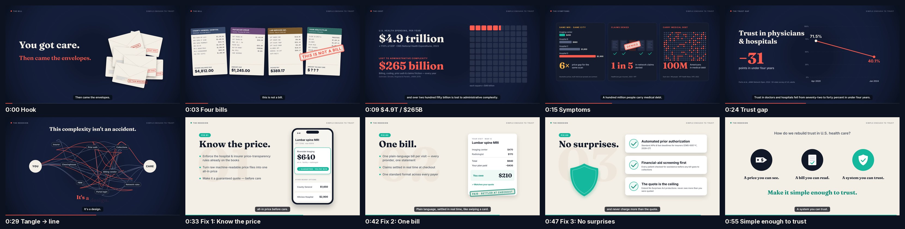

# Simple Enough to Trust — a 60-second explainer

**Question:** How can we eliminate financial complexity and rebuild trust in U.S. health care?

**Answer in one line:** Make care *knowable before*, *legible after*, and *safe throughout*: know the price, get one bill, owe no surprises.

`simple-enough-to-trust.mp4` — 60.0 s · 1920×1080 · 30 fps · H.264/AAC · −15 LUFS · captions burned in.

## Story arc
The video tells the story through its design. The first half is dark, cluttered and red, with a heartbeat that speeds up. At 0:32 the tangle of middlemen straightens into one line between **YOU** and **CARE**, a wipe turns the screen to light paper, and the music shifts from a minor key to a major one.

| Time | Scene | Visual | Voiceover |
|---|---|---|---|
| 0:00 | Hook | Envelopes rain onto the screen ("PAST DUE", "FINAL NOTICE") | You got care. Then came the envelopes. |
| 0:03 | Four bills | Hospital, physician and lab bills and an EOB, full of CPT/REV/CARC codes; a stamp lands: THIS IS NOT A BILL | A hospital bill. A doctor bill. A lab bill. And a letter that says: this is not a bill. |
| 0:09 | The cost | $4.9T counter; a 100-square unit chart in which 5.4 squares turn red ($265B) | Nearly $5T a year, and over $250B lost to administrative complexity. |
| 0:15 | Symptoms | Three panels: 6× MRI price spread · 1 in 5 claims denied · 100 of 330 dots = medical debt | Same scan, six times more… one in five claims denied… a hundred million in debt… |
| 0:24 | Trust gap | Slope chart 71.5% → 40.1%, −31 pts | Trust in doctors and hospitals fell from 72 percent to 40. |
| 0:29 | Pivot | Nine tangled strands through Insurer / PBM / Prior auth / Collections… straighten into one teal line; dark → light wipe | This complexity isn't an accident. It's a design. So let's redesign it. |
| 0:33 | Fix 01: Know the price | Phone: a 48 GB machine-readable JSON file resolves into a $640 all-in guaranteed quote with alternatives | Enforce the transparency laws we already have, and guarantee an all-in price before care. |
| 0:42 | Fix 02: One bill | The four messy bills collapse into one plain-language statement ($210 owed, matches quote); a card swipe gives PAID · SETTLED AT CHECKOUT | One bill. In plain language, settled at checkout, like swiping a card. |
| 0:47 | Fix 03: No surprises | Shield plus three checked commitments | Automate prior authorization, screen for financial aid before collections, and never charge more than the quote. |
| 0:55 | Close | Price tag · bill · shield, then "Make it simple enough to trust." | A price you can see. A bill you can read. A system you can trust. |

## Policy grounding
- **Know the price** builds on the CMS Hospital Price Transparency rule (2021), the Transparency in Coverage rule (insurer machine-readable files, 2022), the No Surprises Act's Good Faith Estimates, and the Feb 2025 executive order on enforcing actual-price disclosure. The gap it fills: the data exists but can't be acted on, and compliance has been uneven. The proposal turns estimates into **binding all-in quotes**.
- **One bill** means a single consolidated statement per episode of care in a standard format, with real-time claims adjudication at checkout.
- **No surprises** builds on the CMS Interoperability & Prior Authorization Final Rule (CMS-0057-F), which sets prior-auth decision deadlines from 2026 and requires FHIR APIs by 2027. It also extends the No Surprises Act, making the quote the ceiling on patient liability, and requires screening for financial assistance before any account goes to collections.

## Sources for on-screen figures
- $4.9T national health spending, 17.6% of GDP (2023): CMS National Health Expenditure Accounts.
- ~$265B/yr waste from administrative complexity: Shrank, Rogstad & Parekh, *JAMA* 2019.
- ~1 in 5 in-network claims denied (HealthCare.gov insurers, 2023): KFF.
- ~100M people with medical debt: KFF Health News / KFF, 2022.
- Trust in physicians & hospitals 71.5% (Apr 2020) → 40.1% (Jan 2024): Perlis et al., *JAMA Network Open*, 2024.
- MRI price bars and the $640/$210 example are **illustrative** and labelled as such on screen.

## How it was made (fully reproducible, no stock assets)
- `src/vo.json`: script. `src/tts.py` voices it with Kokoro-82M (Apache-2.0, voice `af_heart`) at natural speed (about 150 wpm, with pauses between lines). It is processed through a light vocal chain (rumble cut, gentle compression, a little warmth and air) with no saturation, and the music ducks about 9 dB under speech.
- `src/timing.py`: lays the VO clips onto the 60 s timeline and writes `timing.js` (scene starts and caption cues). Animations are keyed to the moment each phrase is spoken.
- `src/index.html`: every illustration, chart and motion curve is hand-drawn in Canvas 2D. `render(t)` is a pure function of time. Fonts: Fraunces, Inter, JetBrains Mono (OFL).
- `src/audio.py`: synthesized score (Am–F–Dm–E pads with a heartbeat, then Cmaj7–F–G–Am with plucked arpeggios), SFX (whooshes, stamp hits, chimes), sidechain ducking under VO, loudness normalization.
- `src/capture.js`: headless Chromium steps through frames in 4 parallel chunks and streams them to ffmpeg.
- `./build.sh` rebuilds the MP4 in about a minute.
